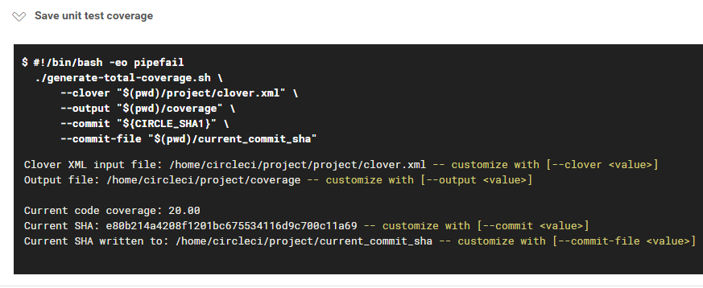
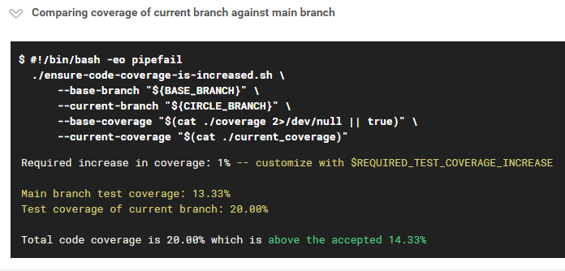

# circleci-code-coverage-compare

Fix your tech debt, one PR at a time!

This project provides a way to ensure unit test coverage is increased in every pull request **without the need for external tools such as Coveralls.io**.

It does this by providing the following functionality:

1. Parse clover XML output to generate a total unit test code coverage
   > Based on [https://confluence.atlassian.com/pages/viewpage.action?pageId=79986990]

2. Cache this value as a file within Circle CI, using the **commit SHA** as the key.

3. If the job is running on non-master:
   > 1. Fetch the current commit SHA of the master branch using the GitHub API
   > 2. Load from cache the coverage stored for that SHA
   > 3. Compare the values, and fail the job if code coverage is not increased.

All values are customizable including the base branch (if using something other than `master`) and the amount code coverage must be increased (may be set to `0` for no increase).

## Example usage

Save code coverage to Circle CI cache | Compare coverage against main branch
------------------------------------- | ---
        | 

## Example Circle CI configuration

Create a new job that runs after your unit tests.

```yaml
jobs:
    validate_coverage:
        docker: [ { image: 'skluck/circleci-required-coverage:latest' } ]
        environment:
            - BASE_BRANCH: "master" # This is the default and can be removed (from the script arguments as well)
            # - REQUIRED_TEST_COVERAGE_INCREASE # Set this environment variable in Circle environment variables to make this more dynamic. Default: 1%

        steps:
            - attach_workspace: { at: '.' }

            - run:
                name: "Save unit test coverage"
                command: |
                    ./generate-total-coverage.sh \
                        --clover "$(pwd)/project/clover.xml" \ # Change this value to the location of your clover report
                        --output "$(pwd)/coverage" \
                        --commit "${CIRCLE_SHA1}" \
                        --commit-file "$(pwd)/current_commit_sha"

            - save_cache:
                key: 'v1-unit-test-coverage-{{ checksum "current_commit_sha" }}'
                paths: [ './coverage' ]

            - run:
                name: "Get unit test coverage of main branch"
                command: |
                    mv ./coverage ./current_coverage
                    ./fetch-target-sha.sh \
                        --user ${CIRCLE_PROJECT_USERNAME} \
                        --repo ${CIRCLE_PROJECT_REPONAME} \
                        --base-branch "${BASE_BRANCH}" \
                        --current-branch "${CIRCLE_BRANCH}" \
                        --commit-file "$(pwd)/base_commit_sha"

            - restore_cache:
                keys: [ 'v1-unit-test-coverage-{{ checksum "base_commit_sha" }}' ]

            - run:
                name: "Comparing coverage of current branch against main branch"
                command: |
                    ./ensure-code-coverage-is-increased.sh \
                        --base-branch "${BASE_BRANCH}" \
                        --current-branch "${CIRCLE_BRANCH}" \
                        --base-coverage "$(cat ./coverage 2>/dev/null || true)" \
                        --current-coverage "$(cat ./current_coverage)"
```

Make sure to run this job after your unit tests:

```yaml
workflows:
    version: 2

    pipeline:
        jobs:
            - build_and_test
            - validate_coverage:
                requires: [ build_and_test ]
```
